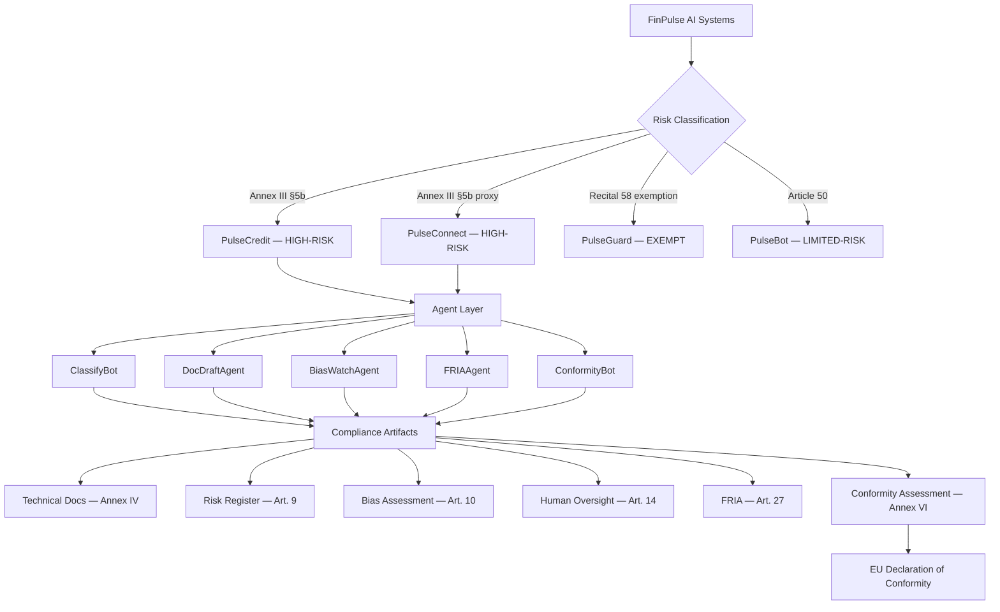

# EU AI Act Compliance Portfolio — FinPulse NL B.V.

[](https://github.com/DimosGougousis/EU-AI-Act/actions/workflows/python-tests.yml)
[](https://github.com/DimosGougousis/EU-AI-Act/actions/workflows/html-validation.yml)
[](https://www.python.org/)
[](https://artificialintelligenceact.eu/)
[](LICENSE)

> An EU AI Act compliance programme proposal for a Dutch FinTech — featuring **5 executable compliance automation agents** built on the OpenAI API, 11 regulatory artifacts, and a full pytest suite. **No API key needed to run the tests.**

**[Live Portfolio →](https://dimosGougousis.github.io/EU-AI-Act)**

---

## The Problem

The EU AI Act (Regulation 2024/1689) became enforceable for high-risk AI systems on **August 2, 2026**. For a multi-product Dutch FinTech like FinPulse NL B.V., compliance means navigating **four overlapping regulatory frameworks** simultaneously:

| Framework | Regulator | AI Obligation |
|-----------|-----------|---------------|
| EU AI Act (2024/1689) | RDI (Market Surveillance) | Arts. 9–15, 27, 43 |
| GDPR (2016/679) | Dutch DPA (AP) | DPIA, Art. 22 automated decisions |
| DORA (2022/2554) | DNB | ICT risk management (Art. 15 overlap) |
| PSD2 / Wft | DNB + AFM | Open banking data, consumer credit |

The standard PM response is a compliance gap tracker in a spreadsheet. This programme proposal demonstrates a different approach: **treat compliance obligations as product features** — scope them, prioritise them, automate the highest-effort ones, and track the backlog with the same rigour as a product roadmap.

---

## What This Is (PM Perspective)

This programme proposal documents **end-to-end product delivery** of an EU AI Act compliance programme for a Dutch FinTech. It shows PM work across the full stack:

| PM Activity | What's Here |
|-------------|-------------|
| **Discovery & scoping** | 21-gap article-by-article gap analysis, AI inventory classification, regulatory cross-reference table |
| **Prioritisation under constraint** | Phased 6-month roadmap to Aug 2026 deadline, 136 FTE-days effort model, €53–93k external cost range |
| **Stakeholder & delivery design** | RACI matrix across CPO/CTO/DPO/Legal, HITL oversight model with loan officer training plan |
| **Build vs. buy vs. automate** | 5 agents targeting highest-effort manual tasks (classification, doc drafting, bias monitoring, FRIA, conformity) |
| **Quality & test discipline** | Full pytest suite (68 tests), GitHub Actions CI, no tests skip even without API keys |
| **Honest status reporting** | 15% conformity score with 4 open Critical NCRs — not inflated, tracked as GitHub Issues |

---

## Architecture



---

## Agent Quick Reference

| Agent | Trigger | Primary Input | Output | EU AI Act Article |
|-------|---------|--------------|--------|-------------------|
| **ClassifyBot** | New AI system registered | System description dict | Risk tier + Annex III citation | Art. 6, Annex III |
| **DocDraftAgent** | Model deployed/updated | MLflow registry URI | Annex IV draft (78% auto-populated) | Art. 11, Annex IV |
| **BiasWatchAgent** | Weekly cron (Mon 07:00 CET) | Decision log date range | Fairness report + incident tickets | Art. 10(4) |
| **FRIAAgent** | New deployment | System + population description | FRIA covering 6 EUCFR rights | Art. 27 |
| **ConformityBot** | Monthly / pre-milestone | System ID + repo path | Annex VI report + NCR list | Art. 43, Annex VI |

---

## Agent Output Examples

<details>
<summary><strong>ClassifyBot</strong> — PulseCredit v2.1 classification</summary>

```json
{
  "risk_tier": "HIGH_RISK",
  "legal_basis": "Annex III, Point 5(b)",
  "confidence": 0.97,
  "obligations": [
    "Art. 9 — Risk Management System",
    "Art. 10 — Data Governance",
    "Art. 11 + Annex IV — Technical Documentation",
    "Art. 12 — Logging (min. 6 months)",
    "Art. 13 — Transparency / Instructions for Use",
    "Art. 14 — Human Oversight",
    "Art. 15 — Accuracy, Robustness, Cybersecurity",
    "Art. 43 — Conformity Assessment (Annex VI)",
    "Art. 27 — Fundamental Rights Impact Assessment"
  ],
  "deadline": "2026-08-02"
}
```
</details>

<details>
<summary><strong>BiasWatchAgent</strong> — Week 2026-W09 fairness report</summary>

```json
{
  "status": "BREACH_DETECTED",
  "week": "2026-W09",
  "decisions_analysed": 3847,
  "metrics": {
    "gender_dpd": 0.006,
    "age_bracket_dpd": 0.102,
    "nationality_dpd": 0.031,
    "psi_score": 0.18
  },
  "breaches": [
    {
      "metric": "demographic_parity",
      "group_a": "age_18_30",
      "group_b": "age_31_54",
      "value": 0.102,
      "threshold": 0.05,
      "ticket": "INC-2026-0147"
    }
  ],
  "report_published": true
}
```

> Age bracket demographic parity gap (10.2%) exceeds the 5% Article 10 threshold — incident ticket auto-created for the data science team.
</details>

<details>
<summary><strong>DocDraftAgent</strong> — Annex IV technical documentation</summary>

```json
{
  "status": "DRAFT_SAVED",
  "system": "PulseCredit v2.1",
  "completeness_pct": 78.0,
  "sections_completed": [
    "1. General Description",
    "2. Intended Purpose and Deployment Context",
    "3. Training Data Description (PSD2 + BKR, 240k records)",
    "4. Performance Metrics (AUC-ROC: 0.847, Gini: 0.694)",
    "5. Risk Management Summary"
  ],
  "sections_pending": [
    "6. Post-Market Monitoring Plan",
    "7. Serious Incident Reporting Procedure"
  ],
  "artifact_path": "sharepoint://compliance/eu-ai-act/pulsecredit/annex-iv-draft-v1.docx"
}
```
</details>

<details>
<summary><strong>FRIAAgent</strong> — Article 27 Fundamental Rights Impact Assessment</summary>

```json
{
  "status": "DRAFT_GENERATED",
  "system": "PulseCredit v2.1",
  "affected_population": "Dutch consumers aged 18-75",
  "rights_assessed": 6,
  "residual_risks": {
    "non_discrimination": "MEDIUM",
    "privacy_data_protection": "LOW",
    "access_to_financial_services": "HIGH",
    "right_to_explanation": "MEDIUM",
    "human_dignity": "LOW",
    "freedom_from_manipulation": "LOW"
  },
  "mitigation_measures": 14,
  "report_path": "sharepoint://compliance/eu-ai-act/pulsecredit/fria-draft-v1.docx"
}
```

> `access_to_financial_services` rated HIGH residual risk — automated Decline decisions for thin-file applicants require mandatory human review under Art. 14.
</details>

<details>
<summary><strong>ConformityBot</strong> — February 2026 Annex VI baseline assessment</summary>

```json
{
  "status": "REPORT_GENERATED",
  "system_id": "pulsecredit-v2.1",
  "assessment_date": "2026-02-28",
  "overall_score": 15.0,
  "ncr_count": 4,
  "ncrs": [
    {
      "id": "NCR-001",
      "article": "Art. 12",
      "obligation": "Log retention ≥183 days",
      "status": "FAIL",
      "finding": "Current retention: 30 days. Minimum: 183 days."
    },
    {
      "id": "NCR-002",
      "article": "Art. 11",
      "obligation": "Annex IV documentation >80% complete",
      "status": "PARTIAL",
      "finding": "50% complete — performance metrics section missing."
    },
    {
      "id": "NCR-003",
      "article": "Art. 15",
      "obligation": "Adversarial robustness testing",
      "status": "FAIL",
      "finding": "No adversarial or distributional shift testing conducted."
    },
    {
      "id": "NCR-004",
      "article": "Art. 14",
      "obligation": "HITL mechanism in production",
      "status": "FAIL",
      "finding": "HITL deployed in staging only. Not yet live."
    }
  ],
  "next_assessment": "2026-03-31"
}
```

> 15% conformity score reflects the Feb 2026 baseline — 5 months before the Aug 2026 deadline. All 4 NCRs are tracked as [GitHub Issues](../../issues) against the implementation roadmap milestones.
</details>

---

## Skills Demonstrated

| PM Competency | Evidence | Artifact |
|---------------|----------|----------|
| **Regulatory translation** | Four overlapping frameworks (EU AI Act + GDPR + DORA + PSD2) mapped to specific product obligations per AI system | `02-ai-inventory.html`, `03-gap-analysis.html` |
| **Risk-based prioritisation** | 21 compliance gaps triaged by severity, owner, and deadline; 4 Critical NCRs escalated as GitHub Issues | `03-gap-analysis.html`, GitHub Issues #1–4 |
| **Delivery planning** | 5-phase roadmap: 136 FTE-days effort, €53–93k external budget, RACI matrix, Aug 2026 milestone | `04-roadmap.html` |
| **Ambiguity & judgment** | PulseConnect re-classified High-Risk via postcode proxy analysis; PulseGuard Recital 58 exemption boundary decision | `02-ai-inventory.html`, `docs/decisions.md` |
| **Build vs. automate** | 5 agents targeting highest-effort manual tasks — bias monitoring alone saves ~4 person-days/week | `agents/`, `05-agents.html` |
| **Honest status reporting** | Feb 2026 conformity score: 15% — open NCRs reported, not suppressed | `artifacts/11-conformity.html` |
| **Test discipline** | 68 pytest tests across 5 agents, mocked API, CI on every push | `tests/`, `.github/workflows/` |
| **Operational thinking** | Bias monitoring thresholds (DPD > 0.05, PSI > 0.25, AUC < 0.75), weekly schedule at Amsterdam timezone | `agents/bias_watch_agent.py` |

---

## Compliance Portfolio

### Live HTML Portfolio

| Page | Content | Key Regulatory Basis |
|------|---------|---------------------|
| [`index.html`](index.html) | Executive summary + compliance dashboard | — |
| [`01-company-profile.html`](01-company-profile.html) | FinPulse NL B.V. profile, AI products, licences | Art. 3 (definitions) |
| [`02-ai-inventory.html`](02-ai-inventory.html) | AI inventory + risk-tier classification rationale | Art. 6, Annex III, Recital 58 |
| [`03-gap-analysis.html`](03-gap-analysis.html) | Per-article gap analysis (21 gaps identified) | Arts. 9–15, 26, 27, 43 |
| [`04-roadmap.html`](04-roadmap.html) | Phased implementation plan → August 2, 2026 | All articles |
| [`05-agents.html`](05-agents.html) | AI agent use cases with code and tool templates | Art. 14 (human oversight by design) |

### Compliance Artifacts (PulseCredit v2.1)

| Artifact | Content | Article |
|----------|---------|---------|
| [`06-technical-doc.html`](artifacts/06-technical-doc.html) | Annex IV technical file | Art. 11 |
| [`07-risk-management.html`](artifacts/07-risk-management.html) | Risk register (9 risks) | Art. 9 |
| [`08-data-governance.html`](artifacts/08-data-governance.html) | Data governance + Fairlearn bias results | Art. 10 |
| [`09-human-oversight.html`](artifacts/09-human-oversight.html) | HITL/HIC design + loan officer training | Art. 14 |
| [`10-fria.html`](artifacts/10-fria.html) | Fundamental Rights Impact Assessment | Art. 27 |
| [`11-conformity.html`](artifacts/11-conformity.html) | Annex VI assessment + EU Declaration of Conformity | Art. 43 |

---

## Open Non-Conformities (NCRs)

The February 2026 baseline conformity assessment identified 4 open NCRs tracked as GitHub Issues:

| Issue | NCR ID | Article | Severity |
|-------|--------|---------|----------|
| [Log retention insufficient (30 days vs 6-month minimum)](../../issues/1) | NCR-001 | Art. 12 | CRITICAL |
| [Annex IV technical documentation incomplete](../../issues/2) | NCR-002 | Art. 11 | HIGH |
| [No adversarial robustness testing conducted](../../issues/3) | NCR-003 | Art. 15 | HIGH |
| [Human-in-the-Loop (HITL) mechanism not deployed](../../issues/4) | NCR-004 | Art. 14 | CRITICAL |

Overall February 2026 conformity score: **15%** → target August 2026: **100%**

---

## Repository Structure

```
EU-AI-Act/
├── .github/
│   ├── workflows/
│   │   ├── python-tests.yml        # pytest on push/PR (Python 3.11 + 3.12)
│   │   └── html-validation.yml     # htmlhint on push/PR
│   └── ISSUE_TEMPLATE/
│       └── ncr-report.md           # Non-Conformity Report template
├── agents/
│   ├── __init__.py
│   ├── schemas/                    # JSON tool definitions (5 files)
│   ├── classify_bot.py
│   ├── doc_draft_agent.py
│   ├── bias_watch_agent.py
│   ├── fria_agent.py
│   └── conformity_bot.py
├── tests/
│   ├── conftest.py                 # Shared fixtures (mock LLM client)
│   ├── test_classify_bot.py
│   ├── test_bias_watch_agent.py
│   ├── test_doc_draft_agent.py
│   ├── test_fria_agent.py
│   └── test_conformity_bot.py
├── docs/
│   ├── architecture.md             # Agent architecture diagrams
│   └── decisions.md                # Key product decisions + trade-offs
├── artifacts/                      # HTML compliance artifacts (06–11)
├── css/style.css
├── index.html ... 05-agents.html   # HTML portfolio pages
├── pyproject.toml
├── requirements.txt
└── README.md
```

---

## Running the Agents Locally

### Prerequisites

```bash
python --version   # Python 3.11 or 3.12
pip --version
```

### Installation

```bash
git clone https://github.com/DimosGougousis/EU-AI-Act.git
cd EU-AI-Act
pip install -e ".[dev]"
```

### Running Tests (no API key required)

```bash
pytest tests/ -v
```

All tests mock the LLM client — no `OPENAI_API_KEY` needed. The CI pipeline runs the same command on every push.

### Running Agents (requires OpenAI API key)

```bash
export OPENAI_API_KEY=your_key_here

# Classify a new AI system
python -m agents.classify_bot

# Generate Annex IV technical documentation draft
python -m agents.doc_draft_agent

# Run bias monitoring (single run)
python -m agents.bias_watch_agent

# Generate FRIA
python -m agents.fria_agent

# Run conformity assessment
python -m agents.conformity_bot
```

---

## Key Regulatory Dates

| Date | Milestone |
|------|-----------|
| August 1, 2024 | EU AI Act enters force |
| February 2, 2025 | Prohibited AI practices banned |
| **August 2, 2026** | **High-risk AI obligations enforceable** |
| December 31, 2030 | Legacy system compliance deadline |

---

## Regulatory Basis

- [Regulation (EU) 2024/1689 — EU AI Act](https://artificialintelligenceact.eu/)
- Articles: 5, 6, 9, 10, 11, 12, 13, 14, 15, 16, 22, 26, 27, 43, 50, 99
- Annexes: III (high-risk list), IV (technical documentation), V (declaration), VI (internal control)
- Recital 58 — Fraud detection exemption
- DNB SAFEST Framework (2019) | DNB/AFM Joint AI Report (2024)
- GDPR (2016/679) | DORA (2022/2554) | PSD2 | Wft (Dutch Financial Supervision Act)

---

## Disclaimer

FinPulse NL B.V. is a **fictional company** used for illustrative purposes. This is a programme proposal demonstrating how a Dutch FinTech can approach EU AI Act compliance. It does not constitute legal advice. Regulatory interpretations reflect the EU AI Act as in force in February 2026.

---

*EU AI Act Compliance Portfolio — February 2026 | Built with [OpenAI API](https://platform.openai.com/docs)*
