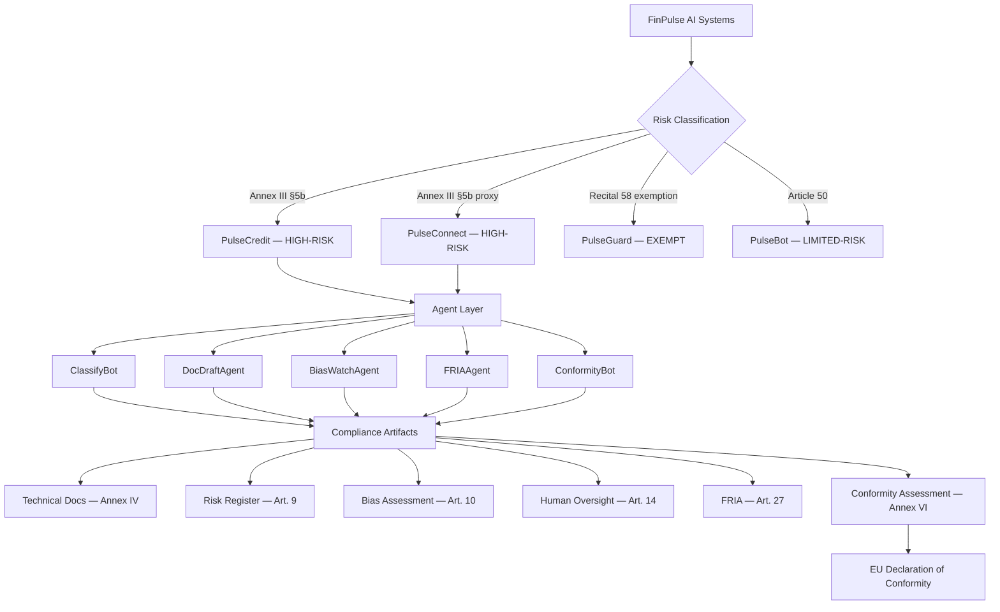

# EU AI Act Compliance Portfolio — FinPulse NL B.V.

[](https://github.com/DimosGougousis/EU-AI-Act/actions/workflows/python-tests.yml)
[](https://github.com/DimosGougousis/EU-AI-Act/actions/workflows/html-validation.yml)
[](https://www.python.org/)
[](https://artificialintelligenceact.eu/)
[](LICENSE)

> A production-grade EU AI Act compliance portfolio for a hypothetical Dutch FinTech — featuring **5 executable compliance automation agents** built on the OpenAI API, 11 regulatory artifacts, and a full pytest suite. **No API key needed to run the tests.**

**[Live Portfolio →](https://dimosGougousis.github.io/EU-AI-Act)**

---

## The Problem

The EU AI Act (Regulation 2024/1689) became enforceable for high-risk AI systems on **August 2, 2026**. For a multi-product Dutch FinTech like FinPulse NL B.V., compliance means navigating **four overlapping regulatory frameworks** simultaneously:

| Framework | Regulator | AI Obligation |
|-----------|-----------|---------------|
| EU AI Act (2024/1689) | RDI (Market Surveillance) | Arts. 9–15, 27, 43 |
| GDPR (2016/679) | Dutch DPA (AP) | DPIA, Art. 22 automated decisions |
| DORA (2022/2554) | DNB | ICT risk management (Art. 15 overlap) |
| PSD2 / Wft | DNB + AFM | Open banking data, consumer credit |

This portfolio demonstrates how to **systematically address that complexity** — from risk classification through to a signed EU Declaration of Conformity — and how **AI agents can automate the highest-effort compliance tasks**.

---

## Architecture



---

## Skills Demonstrated

| Skill | Demonstrated By | Artifact |
|-------|----------------|----------|
| **Regulatory Analysis** | Four-tier risk classification with Annex III citations, Recital 58 boundary analysis | `02-ai-inventory.html` |
| **Agentic System Design** | 5-agent compliance automation platform with tool schemas, agentic loops, APScheduler | `agents/` package |
| **Data & Bias Governance** | Fairlearn demographic parity assessment, postcode proxy removal, corrective actions | `artifacts/08-data-governance.html` |
| **Human-in-the-Loop Design** | Tiered HITL/HIC oversight model, SHAP explainability, override mechanism | `artifacts/09-human-oversight.html` |
| **Fundamental Rights Assessment** | Article 27 FRIA across 6 EUCFR rights, GDPR DPIA cross-reference | `artifacts/10-fria.html` |
| **Conformity Assessment** | Annex VI self-assessment, NCR tracking, EU Declaration of Conformity | `artifacts/11-conformity.html` |
| **Product Roadmapping** | Phased 6-month implementation plan, RACI matrix, 136 FTE-day effort model | `04-roadmap.html` |
| **Software Engineering** | Python package, pytest suite, GitHub Actions CI | `agents/`, `tests/`, `.github/` |
| **Technical Writing** | 11 regulatory artifacts following EU legal document conventions | `artifacts/` directory |

---

## Agent Quick Reference

| Agent | Trigger | Primary Input | Output | EU AI Act Article |
|-------|---------|--------------|--------|-------------------|
| **ClassifyBot** | New AI system registered | System description dict | Risk tier + Annex III citation | Art. 6, Annex III |
| **DocDraftAgent** | Model deployed/updated | MLflow registry URI | Annex IV draft (78% auto-populated) | Art. 11, Annex IV |
| **BiasWatchAgent** | Weekly cron (Mon 07:00 CET) | Decision log date range | Fairness report + incident tickets | Art. 10(4) |
| **FRIAAgent** | New deployment | System + population description | FRIA covering 6 EUCFR rights | Art. 27 |
| **ConformityBot** | Monthly / pre-milestone | System ID + repo path | Annex VI report + NCR list | Art. 43, Annex VI |

---

## Compliance Portfolio

### Live HTML Portfolio

| Page | Content | Key Regulatory Basis |
|------|---------|---------------------|
| [`index.html`](index.html) | Executive summary + compliance dashboard | — |
| [`01-company-profile.html`](01-company-profile.html) | FinPulse NL B.V. profile, AI products, licences | Art. 3 (definitions) |
| [`02-ai-inventory.html`](02-ai-inventory.html) | AI inventory + risk-tier classification rationale | Art. 6, Annex III, Recital 58 |
| [`03-gap-analysis.html`](03-gap-analysis.html) | Per-article gap analysis (21 gaps identified) | Arts. 9–15, 26, 27, 43 |
| [`04-roadmap.html`](04-roadmap.html) | Phased implementation plan → August 2, 2026 | All articles |
| [`05-agents.html`](05-agents.html) | AI agent use cases with code and tool templates | Art. 14 (human oversight by design) |

### Compliance Artifacts (PulseCredit v2.1)

| Artifact | Content | Article |
|----------|---------|---------|
| [`06-technical-doc.html`](artifacts/06-technical-doc.html) | Annex IV technical file | Art. 11 |
| [`07-risk-management.html`](artifacts/07-risk-management.html) | Risk register (9 risks) | Art. 9 |
| [`08-data-governance.html`](artifacts/08-data-governance.html) | Data governance + Fairlearn bias results | Art. 10 |
| [`09-human-oversight.html`](artifacts/09-human-oversight.html) | HITL/HIC design + loan officer training | Art. 14 |
| [`10-fria.html`](artifacts/10-fria.html) | Fundamental Rights Impact Assessment | Art. 27 |
| [`11-conformity.html`](artifacts/11-conformity.html) | Annex VI assessment + EU Declaration of Conformity | Art. 43 |

---

## Repository Structure

```
EU-AI-Act/
├── .github/
│   ├── workflows/
│   │   ├── python-tests.yml        # pytest on push/PR (Python 3.11 + 3.12)
│   │   └── html-validation.yml     # htmlhint on push/PR
│   └── ISSUE_TEMPLATE/
│       └── ncr-report.md           # Non-Conformity Report template
├── agents/
│   ├── __init__.py
│   ├── schemas/                    # JSON tool definitions (5 files)
│   ├── classify_bot.py
│   ├── doc_draft_agent.py
│   ├── bias_watch_agent.py
│   ├── fria_agent.py
│   └── conformity_bot.py
├── tests/
│   ├── conftest.py                 # Shared fixtures (mock LLM client)
│   ├── test_classify_bot.py
│   ├── test_bias_watch_agent.py
│   ├── test_doc_draft_agent.py
│   ├── test_fria_agent.py
│   └── test_conformity_bot.py
├── docs/
│   └── architecture.md             # Agent architecture diagrams
├── artifacts/                      # HTML compliance artifacts (06–11)
├── css/style.css
├── index.html ... 05-agents.html   # HTML portfolio pages
├── pyproject.toml
├── requirements.txt
└── README.md
```

---

## Running the Agents Locally

### Prerequisites

```bash
python --version   # Python 3.11 or 3.12
pip --version
```

### Installation

```bash
git clone https://github.com/DimosGougousis/EU-AI-Act.git
cd EU-AI-Act
pip install -e ".[dev]"
```

### Running Tests (no API key required)

```bash
pytest tests/ -v
```

All tests mock the LLM client — no `OPENAI_API_KEY` needed. The CI pipeline runs the same command on every push.

### Running Agents (requires OpenAI API key)

```bash
export OPENAI_API_KEY=your_key_here

# Classify a new AI system
python -m agents.classify_bot

# Generate Annex IV technical documentation draft
python -m agents.doc_draft_agent

# Run bias monitoring (single run)
python -m agents.bias_watch_agent

# Generate FRIA
python -m agents.fria_agent

# Run conformity assessment
python -m agents.conformity_bot
```

---

## Key Regulatory Dates

| Date | Milestone |
|------|-----------|
| August 1, 2024 | EU AI Act enters force |
| February 2, 2025 | Prohibited AI practices banned |
| **August 2, 2026** | **High-risk AI obligations enforceable** |
| December 31, 2030 | Legacy system compliance deadline |

---

## Open Non-Conformities (NCRs)

The February 2026 baseline conformity assessment identified 4 open NCRs tracked as GitHub Issues:

| Issue | NCR ID | Article | Severity |
|-------|--------|---------|----------|
| [Log retention insufficient (30 days vs 6-month minimum)](../../issues/1) | NCR-001 | Art. 12 | CRITICAL |
| [Annex IV technical documentation incomplete](../../issues/2) | NCR-002 | Art. 11 | HIGH |
| [No adversarial robustness testing conducted](../../issues/3) | NCR-003 | Art. 15 | HIGH |
| [Human-in-the-Loop (HITL) mechanism not deployed](../../issues/4) | NCR-004 | Art. 14 | CRITICAL |

Overall February 2026 conformity score: **15%** → target August 2026: **100%**

---

## Regulatory Basis

- [Regulation (EU) 2024/1689 — EU AI Act](https://artificialintelligenceact.eu/)
- Articles: 5, 6, 9, 10, 11, 12, 13, 14, 15, 16, 22, 26, 27, 43, 50, 99
- Annexes: III (high-risk list), IV (technical documentation), V (declaration), VI (internal control)
- Recital 58 — Fraud detection exemption
- DNB SAFEST Framework (2019) | DNB/AFM Joint AI Report (2024)
- GDPR (2016/679) | DORA (2022/2554) | PSD2 | Wft (Dutch Financial Supervision Act)

---

## Disclaimer

FinPulse NL B.V. is a **fictional company**. This portfolio is a hypothetical educational exercise illustrating how a Dutch FinTech might approach EU AI Act compliance. It does not constitute legal advice. Regulatory interpretations reflect the EU AI Act as in force in February 2026.

---

*EU AI Act Compliance Portfolio — February 2026 | Built with [OpenAI API](https://platform.openai.com/docs)*
